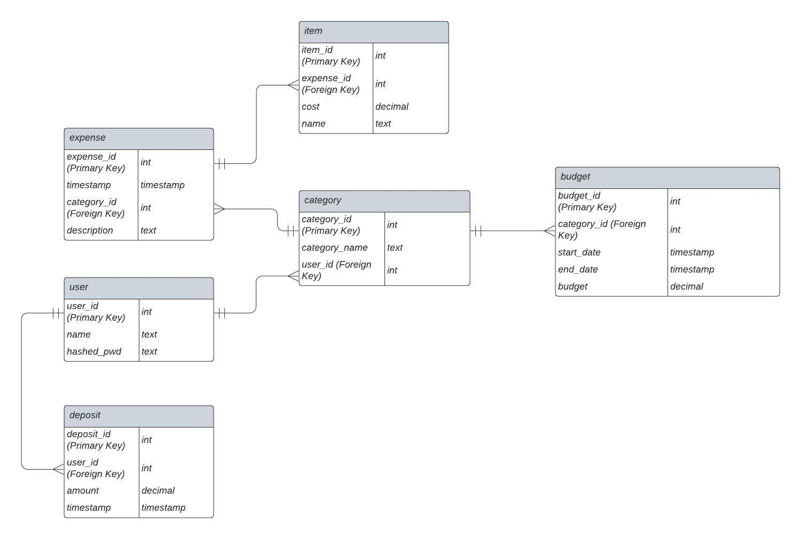

# expense_db
Expense database for CSC-365

Description:
This project will be a backend api for an expense tracker. It should allow users to manage 
their expenses and track their progress. Some of the data tracked will include transaction
data such as price, time/date, item, and category. Other data could include user information
such as spending limits, income, goals, etc. With all this data, a relational database 
seems justified as it will allow us to manage many different scopes of data. 

contributers: jogara@calpoly.edu zlnavarr@calpoly.edu rnair02@calpoly.edu

## User Stories:

- As a customer, I want to be able to add an expense to the database, so that I can access it later
- As a customer, I want to be able to get a past expense and associated data, so that I can read detailed information for each expense
- As a customer, I want to be able to get all the expenses over a given date range or category, so that I can track my spending habits on a macro level
- As a customer, I want to be able to set a budget over a week, so that I can set spending goals
- As a customer, I want to be able to compare my spending to my budget, so that I can track my progress towards my goals

## Endpoints:
### list_users
`GET: /users/`

    This lists the users (primarily used for debugging purposes)

    - `name`: filter for name of user
    - `limit`: the maximum number of results to return
    - `offset`: the number of results to skip
    - `return`: a list of users

### get_user
`GET: /users/{user_id}/`

    This endpoint returns the information associated with a user by its identifier.

    - `user_id`: the ID of the user
    - `return`: the specified user
        - `user_id`: the ID of the user
        - `name`: the name of the user
        - `balance`: the total balance of their account

### create_user
`POST: /users/`

    This endpoint creates a new user.

    - `user`: an object consisting of the following
        - `name`: the name of the user (must be unique)
        - `password`: the password for the user
    - `return`: the resulting user entry

### login_user
`POST: /users/login`

    Used to login users
    
    - `username`: the username to log in with
    - `password`: the password to log in with

### list_deposits
`GET: /user/{user_id}/deposits/`

    This endpoint lists the deposits for a user

    - `user_id`: the user to query
    - `password`: the password for the user
    - `start_date`: the start date for the query (optional
    - `end_date`: the end date for the query (optional)
    - `limit`: the maximum number of results to return
    - `offset`: the number of results to skip
    `return`: a list of deposits

    Each deposit is represented by
    - `deposit_id`: the deposit
    - `amount`: the amount of the deposit
    - `timestamp`: the timestamp of the deposit

### add_deposit
`POST: /user/{user_id}/deposits/`

    This endpoint adds a deposit to the user specified

    - `user_id`: the user to add the deposit to
    - `deposit`: an object consisting of the following
        - `amount`: the amount of the deposit
        - `timestamp`: the timestamp of the deposit
    return`: the resulting deposit entry

### create_category
`POST: /users/{user_id}/categories/`

    This endpoint creates a new category for a specific user.

    - `user_id`: the id of the user
    - `category_json`: object consisting of the following
        - `category_name`: the name of the category to create

### list_categories
`GET: /users/{user_id}/categories`

    This endpoint provides the list of categories associated with a user
    
    - `user_id`: the id of the associated user
    - `limit`: the maximum number of results to return
    - `offset`: the number of results to skip

### get_category
`GET: /users/{user_id}/categories/{category_id}`

    This endpoint returns the details of a specific category
    
    - `user_id`: the id of the user associated with the category
    - `category_id`: the id of the category to get

### category_budget_percentage
`GET: /users/{user_id}/category/budgets`

    This endpoint returns the percentage of a user's overall allocated budget
    on a per-category basis. Categories are ranked overall by percentage descending
    
    - `user_id`: the associated user

### add_budget
`POST: /users/{user_id}/categories/{category_id}/budget/`

    This endpoint adds a budget to a category. It takes as input:

    - `user_id`: the associated user for the budget
    - `category_id`: the category to associate with the budget
    - `budget_entry`: an object consisting of the following
        - `budget`: the dollar amount of the budget
        - `start_date`: The start date for the budget
        - `end_date`: The end date for the budget

### get_budget
`GET: /users/{user_id}/categories/{category_id}/budget/{budget_id}/`

    This endpoint returns a budget entry for a given budget_id. It takes as input:
    
    - `user_id`: the associated user for the budget
    - `category_id`: the associated category for the budget
    - `budget_id`: the budget_id

### list_budget
`GET: /users/{user_id}/categories/{category_id}/budget/`

    This endpoint returns all the budget information associated with a user
    For each budget, the following is returned:
    
    - `budget_id`: the id of the budget
    - `category_name`: the category the budget is associated with
    - `start_date`: the designated start date of the budget
    - `end_date`: the designated end date of the budget
    - `amount`: the amount allocated for the budget

### get_expense
`GET: /users/{user_id}/expenses/{expense_id}`

    This endpoint returns the information associated with an expense by its identifier.
    For each expense it returns:

    - `cost`: the monetary value of the expense, in Dollars
    - `date_time`: the date and time of the expense
    - `expense_id`: the ID of the item associated with the expense
    - `category`: the user defined category of the item
    - `description`: the user defined description of the item

### list_expenses
`GET: /users/{user_id}/expenses`

    This endpoint returns the information associated with expenses
    over a defined time period.
    By default, the difference between `start_date` and `end_date` is one week
    and `end_time` is today.
    Expects format "YYYY-MM-DD HH:MM:SS" for timestamp

    For each expense, it returns:

    - `cost`: the monetary value of the expense, in dollars
    - `date`: the date of the expense
    - `expense_id`: the ID of the item associated with the expense
    - `category`: the user-defined category of the item

### add_expense
`POST: /users/{user_id}/expenses/`

    This endpoint adds a new expense to the database.
    This expense includes:

    - `user`: the user who is adding the expense (required)
    - `cost`: the monetary value of the expense, in Dollars (required)
    - `date_time`: the date and time of the expense. (required)
    - `category_id`: the budget category of the item (required)
    - `description`: the user defined description of the item (not required)

### get_item
`GET: /users/{user_id}/expenses/{expense_id}/items/{item_id}`

    This endpoint returns the information for a specific item
    associated with a specific expense for a specific user.

    - `user_id`: the id of the user
    - `expense_id`: the id of the expense
    - `item_id`: the id of the item
    - `item_name`: the name of the item
    - `cost`: the monetary value of the item, in dollars

### list_items
`GET: /users/{user_id}/expenses/{expense_id}/items`

    This endpoint returns the information for all items
    associated with a specific expense for a specific user.

    - `user_id`: the id of the user
    - `expense_id`: the id of the expense
    - `item_id`: the id of the item
    - `item_name`: the name of the item
    - `cost`: the monetary value of the item, in dollars

### create_item
`/users/{user_id}/expenses/{expense_id}/items`

    This endpoint creates a new item associated
    with a specific expense for a specific user.

    The columns that the item table has are:
    - `item_id`: the id of the item
    - `expense_id`: the id of the expense
    - `cost`: the monetary value of the item, in dollars
    - `name`: the name of the item

## ER Diagram
